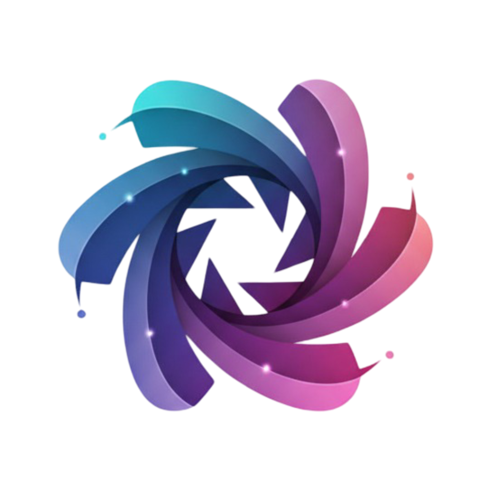

<div align="center">



# Astra AI

### 🚀 Next-Generation AI Chat Platform

**Multi-Model LLM Interface with Custom Inference Optimization**

[](https://github.com/mato2512/Astra)
[](./LICENSE)
[](https://hub.docker.com)
[](https://python.org)

[🌐 Live Demo](https://astra.ngts.tech) • [📚 Documentation](#-documentation) • [🤝 Contributing](#-contributing) • [💬 Support](#-support)

</div>

---

## 🌟 Overview

**Astra AI** is a powerful, self-hosted AI chat platform that combines the flexibility of multiple LLM backends with a modern, intuitive interface. Built with performance and cost-efficiency in mind, Astra supports both **llama.cpp** for optimized inference and **Ollama** for rapid model deployment.

### Why Astra?

- 💰 **90% Cost Reduction** - Self-hosted inference vs. cloud APIs
- ⚡ **High Performance** - Optimized llama.cpp integration
- 🔄 **Multi-Backend** - Switch between llama.cpp and Ollama seamlessly  
- 🎨 **Modern UI** - Clean, responsive interface built with SvelteKit
- 🔒 **Privacy First** - Your data stays on your infrastructure
- 🐳 **Docker Ready** - One-command deployment

---

## ✨ Key Features

### 🤖 Multi-Model Support
- **llama.cpp Integration** - Custom quantized models (GGUF) for optimal performance
- **Ollama Support** - Quick model switching and updates
- **OpenAI Compatible** - Works with any OpenAI-compatible API
- **Model Management** - Easy model selection and configuration

### 💬 Advanced Chat Experience
- **Real-time Streaming** - Live response generation
- **Conversation Memory** - Persistent chat history
- **Multi-turn Dialogues** - Context-aware conversations
- **Markdown & Code** - Full syntax highlighting support

### 📚 Document Intelligence
- **RAG Support** - Upload and chat with your documents
- **Multiple Formats** - PDF, DOCX, TXT, and more
- **Vector Database** - ChromaDB integration for semantic search
- **Web Scraping** - Extract and analyze web content

### 🛠️ Extensibility
- **Custom Functions** - Python-based tool integration
- **API Endpoints** - RESTful API for integrations
- **Plugin System** - Extend functionality with custom plugins
- **Webhook Support** - Connect with external services

### 👥 User Management
- **Role-Based Access** - Admin, user, and custom roles
- **Authentication** - Secure login with JWT tokens
- **Multi-tenancy** - Isolated user workspaces
- **Usage Tracking** - Monitor API calls and costs

### 🎨 Customization
- **Dark/Light Themes** - Multiple color schemes
- **Custom Branding** - Your logo and colors
- **Responsive Design** - Works on desktop, tablet, and mobile
- **PWA Support** - Install as native app

---

## 🏗️ Architecture

```
┌─────────────────────────────────────────────────────┐
│           Astra Frontend (SvelteKit)                │
│  - Modern UI with real-time updates                 │
│  - Model selection & conversation management        │
└────────────────────┬────────────────────────────────┘
                     │
┌────────────────────▼────────────────────────────────┐
│           FastAPI Backend                           │
│  - Request routing & authentication                 │
│  - RAG processing & document handling               │
│  - Unified API for multiple backends                │
└──────────────┬──────────────────────┬───────────────┘
               │                      │
    ┌──────────▼────────┐  ┌─────────▼──────────┐
    │   llama.cpp       │  │      Ollama        │
    │  - GGUF models    │  │  - Quick models    │
    │  - Quantization   │  │  - Easy updates    │
    │  - High speed     │  │  - Model library   │
    └───────────────────┘  └────────────────────┘
```

### Tech Stack

**Frontend**
- ⚡ **SvelteKit** 2.5+ - Modern reactive framework
- 🎨 **Tailwind CSS** 4.0 - Utility-first styling
- 📘 **TypeScript** 5.5+ - Type-safe development
- 🔥 **Vite** 5.4+ - Lightning-fast builds

**Backend**
- 🐍 **FastAPI** 0.118+ - High-performance Python API
- 🗃️ **SQLAlchemy** 2.0+ - Modern ORM
- 🔐 **JWT** - Secure authentication
- 📊 **ChromaDB** - Vector database for RAG

**AI/ML**
- 🦙 **llama.cpp** - Optimized LLM inference
- 🦙 **Ollama** - Model management
- 🤗 **Transformers** - HuggingFace models
- 📈 **Sentence Transformers** - Embeddings

**Infrastructure**
- 🐳 **Docker** - Containerization
- 🔄 **Docker Compose** - Multi-container orchestration
- 🌐 **Nginx** - Reverse proxy
- 🔒 **Let's Encrypt** - SSL certificates

---

## 🚀 Quick Start

### Prerequisites

- **Docker** & **Docker Compose** (recommended)
- **Node.js** 22+ (for development)
- **Python** 3.11+ (for development)
- **4GB+ RAM** (8GB+ recommended)

### 🐳 Docker Deployment (Recommended)

**1. Clone the repository**
```bash
git clone https://github.com/mato2512/Astra.git
cd Astra
```

**2. Run with Docker Compose**
```bash
# For production deployment
docker compose -f docker-compose.prod.yaml up -d

# Or for development
docker compose up -d
```

**3. Access Astra**
```
http://localhost:3000
```

That's it! 🎉

### ⚙️ Configuration

Create a `.env` file in the backend directory:

```env
# Database
DATABASE_URL=sqlite:///data/webui.db

# Ollama
OLLAMA_BASE_URL=http://localhost:11434

# OpenAI (optional)
OPENAI_API_KEY=your_api_key_here

# Application
WEBUI_NAME=Astra AI
WEBUI_SECRET_KEY=generate_a_secure_key_here

# Authentication
ENABLE_SIGNUP=True
DEFAULT_USER_ROLE=user
```

### 🔧 Environment Variables

| Variable | Description | Default |
|----------|-------------|---------|
| `OLLAMA_BASE_URL` | Ollama API endpoint | `http://localhost:11434` |
| `OPENAI_API_KEY` | OpenAI API key (optional) | - |
| `DATABASE_URL` | Database connection string | `sqlite:///data/webui.db` |
| `WEBUI_SECRET_KEY` | JWT secret key | Required |
| `ENABLE_SIGNUP` | Allow new user registration | `True` |
| `DEFAULT_USER_ROLE` | Default role for new users | `user` |

---

## 📦 Installation Methods

### Method 1: Docker Compose (Production)

```bash
# Clone repository
git clone https://github.com/mato2512/Astra.git
cd Astra

# Start services
docker compose -f docker-compose.prod.yaml up -d

# View logs
docker compose logs -f

# Stop services
docker compose down
```

### Method 2: Local Development

**Frontend**
```bash
# Install dependencies
npm install --legacy-peer-deps

# Run development server
npm run dev
# Access: http://localhost:5173
```

**Backend**
```bash
cd backend

# Create virtual environment
python -m venv venv
source venv/bin/activate  # Linux/Mac
# or
.\venv\Scripts\activate  # Windows

# Install dependencies
pip install -r requirements.txt

# Run backend
cd open_webui
uvicorn main:app --host 0.0.0.0 --port 8080 --reload
# Access: http://localhost:8080
```

### Method 3: Docker Hub (Coming Soon)

```bash
docker run -d \
  -p 3000:3000 \
  -v astra-data:/app/data \
  -e OLLAMA_BASE_URL=http://host.docker.internal:11434 \
  yourusername/astra:latest
```

---

## 🎯 Usage

### Setting Up Your First Model

1. **Start Ollama** (if not using Docker bundled version)
   ```bash
   ollama serve
   ```

2. **Pull a model**
   ```bash
   ollama pull llama2:7b
   # or
   ollama pull mistral:7b
   ```

3. **Access Astra** at `http://localhost:3000`

4. **Select Model** from the dropdown in the chat interface

5. **Start Chatting!** 🎉

### Using llama.cpp Models

1. **Download GGUF model** from HuggingFace
   ```bash
   wget https://huggingface.co/...your-model.gguf
   ```

2. **Place in models directory**
   ```bash
   mkdir -p backend/data/models
   mv your-model.gguf backend/data/models/
   ```

3. **Configure backend** to use llama.cpp

4. **Select model** in Astra UI

### Document Chat (RAG)

1. Click **📁 Upload Document** in chat
2. Select PDF, DOCX, or TXT file
3. Use `#document-name` to reference in chat
4. Ask questions about your document!

---

## 🔒 Security

- ✅ **JWT Authentication** - Secure token-based auth
- ✅ **Password Hashing** - Argon2 encryption
- ✅ **RBAC** - Role-based access control
- ✅ **CORS Protection** - Configured origins only
- ✅ **Rate Limiting** - Prevent abuse
- ✅ **SQL Injection Protection** - Parameterized queries

---

## 📊 Performance

### Benchmark Results

| Backend | Model | Tokens/sec | Response Time | Memory |
|---------|-------|-----------|---------------|---------|
| llama.cpp | Llama-2-7B-Q4 | 45-60 | ~2s | 4.8GB |
| llama.cpp | Mistral-7B-Q5 | 40-55 | ~2.5s | 5.2GB |
| Ollama | Llama-2-7B | 35-50 | ~3s | 5.5GB |
| OpenAI API | GPT-3.5 | Varies | ~1.5s | N/A |

*Tested on: Intel i7-10700, 16GB RAM, No GPU*

### Cost Comparison

| Solution | Monthly Cost (10K requests) |
|----------|---------------------------|
| **Astra (Self-hosted)** | **~$50** (server costs) |
| OpenAI GPT-3.5 | ~$200 |
| Anthropic Claude | ~$400 |
| Google Gemini | ~$150 |

**Savings: 75-90%** 💰

---

## 🛠️ Development

### Project Structure

```
Astra/
├── backend/                # FastAPI backend
│   ├── open_webui/        # Main application
│   │   ├── models/        # Database models
│   │   ├── routers/       # API routes
│   │   ├── utils/         # Utilities
│   │   └── main.py        # Entry point
│   └── requirements.txt   # Python deps
├── src/                   # SvelteKit frontend
│   ├── lib/              # Components
│   │   ├── components/   # UI components
│   │   ├── stores/       # State management
│   │   └── utils/        # Helper functions
│   └── routes/           # Pages
├── static/               # Static assets
├── docker-compose.yaml   # Docker config
├── Dockerfile           # Container image
└── package.json         # Node.js deps
```

### Building from Source

```bash
# Clone repository
git clone https://github.com/mato2512/Astra.git
cd Astra

# Build frontend
npm install --legacy-peer-deps
npm run build

# Build Docker image
docker build -t astra:latest .

# Run container
docker run -d -p 3000:8080 astra:latest
```

### Running Tests

```bash
# Frontend tests
npm run test

# Backend tests
cd backend
pytest

# E2E tests
npm run test:e2e
```

---

## 🤝 Contributing

We welcome contributions! Here's how you can help:

### Ways to Contribute

- 🐛 **Report bugs** - Open an issue with details
- 💡 **Suggest features** - Share your ideas
- 📝 **Improve docs** - Help others understand
- 🔧 **Submit PRs** - Fix issues or add features
- ⭐ **Star the repo** - Show your support!

### Contribution Process

1. **Fork** the repository
2. **Create** a feature branch (`git checkout -b feature/amazing-feature`)
3. **Commit** your changes (`git commit -m 'Add amazing feature'`)
4. **Push** to branch (`git push origin feature/amazing-feature`)
5. **Open** a Pull Request

### Code Style

- **Frontend**: Follow ESLint and Prettier configs
- **Backend**: Follow PEP 8 and use Black formatter
- **Commits**: Use conventional commit messages

---

## 📚 Documentation

### Guides

- [Installation Guide](./docs/INSTALLATION.md)
- [Configuration Guide](./docs/CONFIGURATION.md)
- [API Documentation](./docs/API.md)
- [Development Guide](./docs/DEVELOPMENT.md)
- [Deployment Guide](./DIGITAL_OCEAN_SETUP.txt)

### Resources

- [Troubleshooting](./TROUBLESHOOTING.md)
- [FAQ](./docs/FAQ.md)
- [Changelog](./CHANGELOG.md)
- [Roadmap](./docs/ROADMAP.md)

---

## 🗺️ Roadmap

### ✅ Completed

- [x] Multi-model backend support (llama.cpp + Ollama)
- [x] Modern SvelteKit UI
- [x] RAG with document upload
- [x] User authentication and RBAC
- [x] Docker deployment
- [x] Custom branding

### 🚧 In Progress

- [ ] Model fine-tuning interface
- [ ] Advanced analytics dashboard
- [ ] Mobile app (React Native)
- [ ] Voice input/output
- [ ] Multi-language support

### 📋 Planned

- [ ] Plugin marketplace
- [ ] Team collaboration features
- [ ] Advanced RAG with multiple sources
- [ ] Cost tracking per user
- [ ] API key management
- [ ] Kubernetes deployment
- [ ] Model performance comparison
- [ ] Custom model training pipeline

---

## 📄 License

This project is licensed under the **MIT License** - see the [LICENSE](./LICENSE) file for details.

### Third-Party Licenses

This project uses code from various open-source projects. See [LICENSE_HISTORY](./LICENSE_HISTORY) for detailed attribution.

---

## 🙏 Acknowledgments

Special thanks to:

- **Open WebUI** - Original framework foundation
- **Ollama** - Easy LLM deployment
- **llama.cpp** - Efficient inference engine
- **SvelteKit** - Modern web framework
- **FastAPI** - High-performance Python framework
- **HuggingFace** - Model hosting and transformers
- **Open Source Community** - For amazing tools and libraries

---

## 💬 Support

### Get Help

- 📧 **Email**: [prasad@ngts.tech](mailto:prasad@ngts.tech)
- 🐛 **Issues**: [GitHub Issues](https://github.com/mato2512/Astra/issues)
- 💬 **Discussions**: [GitHub Discussions](https://github.com/mato2512/Astra/discussions)

### Community

- ⭐ **Star** this repo to show support
- 🔀 **Fork** to create your own version
- 📢 **Share** with others who might benefit

---

## 📈 Stats


---

<div align="center">

### Built with ❤️ by [Prasad Navale](https://github.com/mato2512)

**Astra AI** - Democratizing AI, One Chat at a Time

[⬆ Back to Top](#astra-ai)

---

**© 2025 Prasad Navale. All rights reserved.**

</div>
